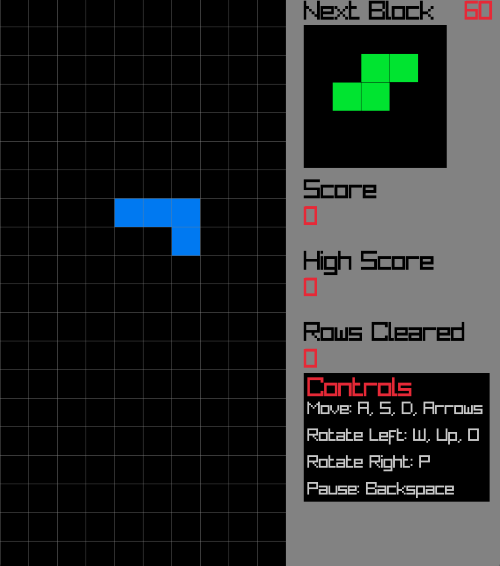

# Tetris Clone

This is a Tetris clone built in C++ using raylib. It includes most traditional Tetris features such as the Super Rotation System, speed increases, rotations, and more!

## Prerequisites
- CMake
- C++ 17 or above

## Installation
Download or clone the repository into your directory of choice.\
``git clone https://github.com/rajahw/TetrisClone``

Create a build directory.\
``
mkdir build\
cd build
``

### The next two steps apply to those using MinGW on Windows. Adjust the CMake and build commands for your operating system and compiler.

Run CMake using a flag for your compiler of choice (Example shows g++ using MinGW).\
``cmake .. -G "MinGW Makefiles"``

Build the executable\
``mingw32-make``

### If you followed the steps correctly, the game executable 'TetrisClone.exe' should be in your build directory.